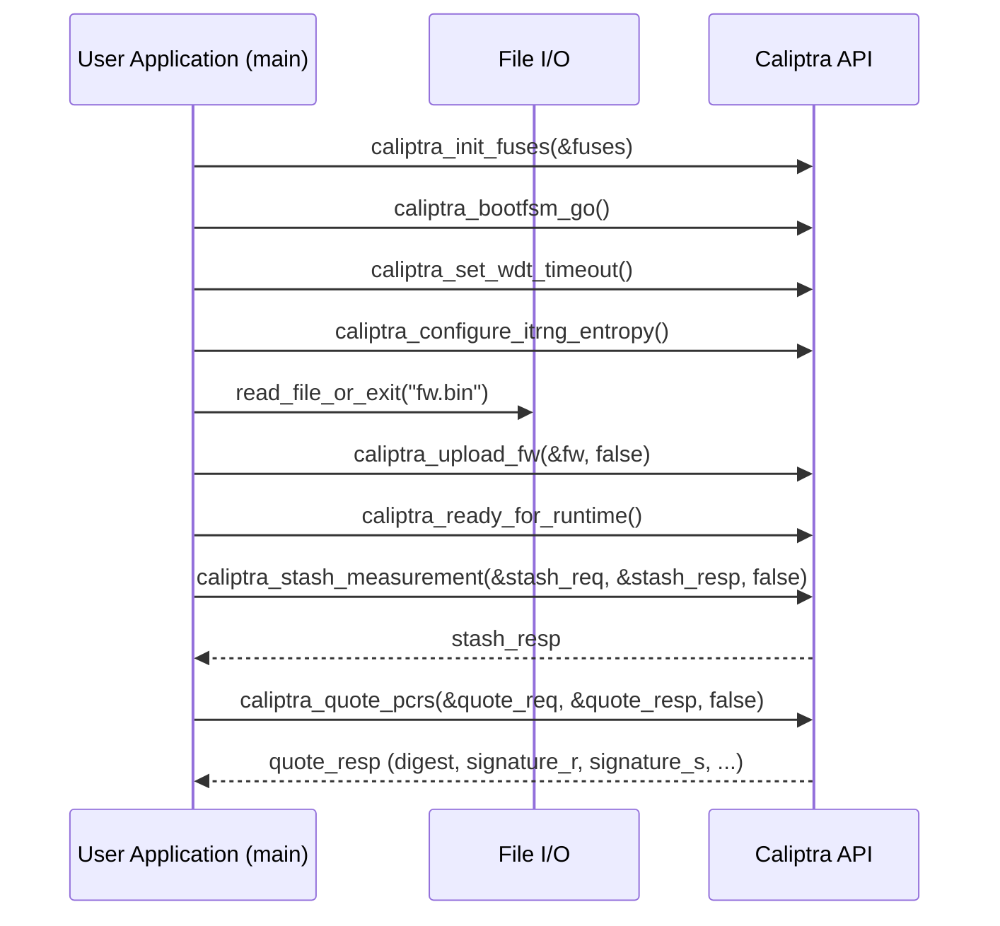

# Sequence Diagram for caliptra_endorsed_aggregated_measured_boot.c

---

This sequence diagram shows the flow of:
- FW image loading
- Caliptra initialization, FW loading, and runtime wait
- Stashing measurements (measured boot)
- Aggregating and quoting PCRs
- (Optional) Attestation signature verification (omitted)
