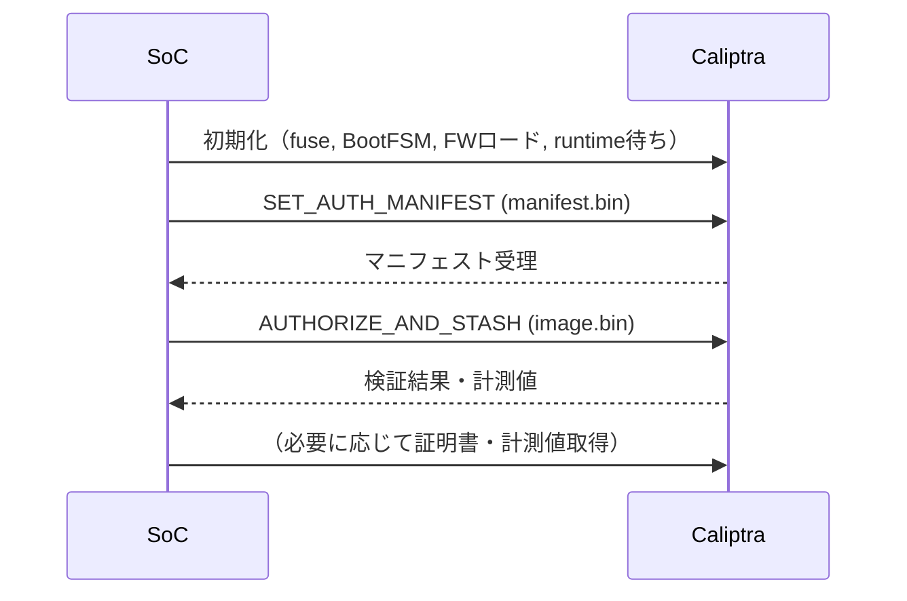

# Caliptra 1.2 SoC Firmware 検証ブートフロー

このドキュメントは、SoCのファームウェア（例: UEFI, BL31, BL33, OSイメージ等）をCaliptra 1.2で検証するための標準的なブートフローをまとめたものです。

---

## 概要

Caliptra 1.2 measured boot/secure bootフローでは、SoCはCaliptraに対して「認可マニフェスト」と「イメージ本体」を順に送信し、Caliptraがイメージの正当性を検証します。

---

## ブートフロー手順

1. **Caliptra初期化**
    - SoCがCaliptraのリセット解除・初期化（fuse設定、BootFSM開始、WDT/iTRNG初期化など）を行う。
    - ファームウェア（FW）イメージをCaliptraへロードし、Caliptraランタイムを起動。

2. **認可マニフェスト（manifest.bin）の送信**
    - SoCは、検証したいFirmwareに対応する「認可マニフェスト」をCaliptraへ送信する。
    - Mailboxコマンド（SET_AUTH_MANIFEST, コマンドID: 0x46534D41）で送信。
    - マニフェストはauth-manifest-gen等のツールで事前生成しておく。

3. **Firmwareイメージ（image.bin）の送信と検証**
    - SoCは、検証したいFirmwareイメージ（例: UEFI, BL31, BL33, etc.）をCaliptraへ送信。
    - Mailboxコマンド（AUTHORIZE_AND_STASH, コマンドID: 0x48535441）で送信。
    - Caliptraは、事前に送信されたマニフェストのポリシー・公開鍵等に従い、イメージの署名やハッシュを検証。
    - 検証に成功した場合、計測値（measurement）がstashingされる。

4. **（必要に応じて）計測値や証明書の取得・検証**
    - SoCは、Caliptraから計測値や証明書を取得し、外部検証やリモート認証に利用できる。

---

## シーケンス図（簡易）

---

## ポイント

- **マニフェスト送信（SET_AUTH_MANIFEST）は必須**：イメージ検証前に必ず行う。
- **イメージ送信（AUTHORIZE_AND_STASH）で検証**：Caliptraが署名・ハッシュを検証し、計測値を保存。
- **イメージ・マニフェストは事前にツールで生成**：auth-manifest-gen等で作成したものを使う。
- **コマンドIDはCaliptra 1.2仕様に準拠**：'AMSF'（0x46534D41）、'ATSH'（0x48535441）。

---

## 参考
- マニフェストやイメージの生成方法は `caliptra-sw/auth-manifest/README.md` などを参照してください。
- サンプルコードは `caliptra_manifest_authorize_and_stash_sample.c` を参照。
