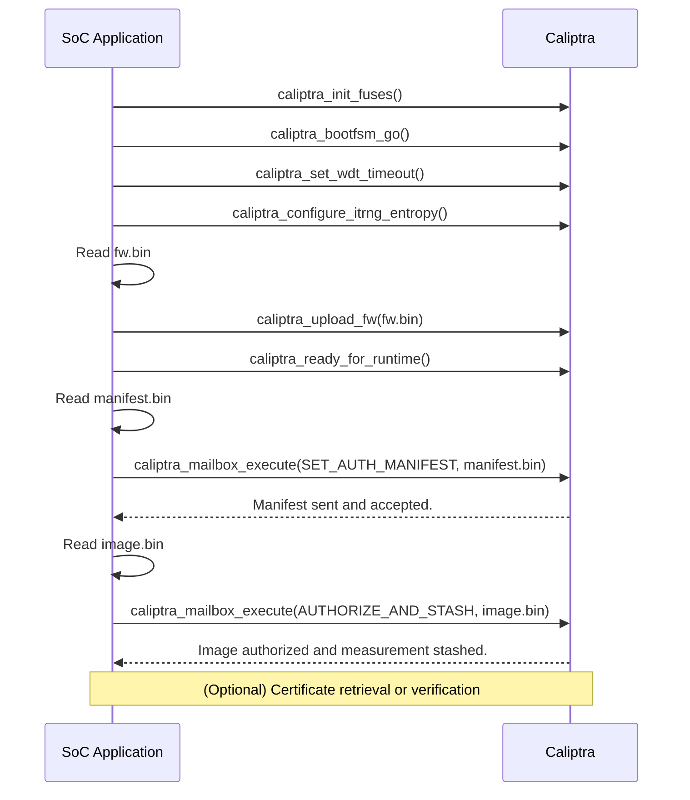

# Caliptra Manifest Authorize and Stash Sample - Sequence Diagram

This document describes the sequence of operations performed by the sample code `caliptra_manifest_authorize_and_stash_sample.c` for Caliptra 1.2 measured boot/secure boot flows.

---

## Sequence Diagram

---

## Description

- The SoC application initializes Caliptra, loads the firmware, and waits for runtime readiness.
- The application reads the manifest and sends it to Caliptra using the SET_AUTH_MANIFEST command (via `caliptra_mailbox_execute`).
- After the manifest is accepted, the application reads the firmware image and sends it to Caliptra using the AUTHORIZE_AND_STASH command (via `caliptra_mailbox_execute`).
- Caliptra verifies the image according to the manifest and stashes the measurement.
- Optionally, the application can retrieve certificates or perform further verification as needed.

---

For details, see the sample code: `caliptra_manifest_authorize_and_stash_sample.c`.
