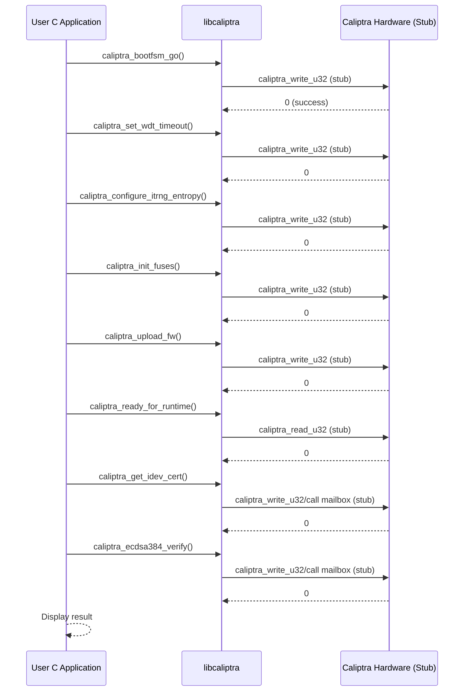

# Sequence Diagram for certificate_and_signature_verification.c (Revised)

This document presents a sequence diagram based on the latest API design and implementation of `certificate_and_signature_verification.c`.

---

## Sequence Diagram

---

## Key Points
- Direct use of `caliptra_mailbox_req`/`resp` is removed; all calls use the dedicated libcaliptra API functions.
- The signature verification API (`caliptra_ecdsa384_verify`) is called with an empty request, as the struct does not contain a message field.
- All hardware access is routed through stubs (`caliptra_write_u32`/`caliptra_read_u32`).

---

This diagram reflects the latest revision of `certificate_and_signature_verification.c`.
