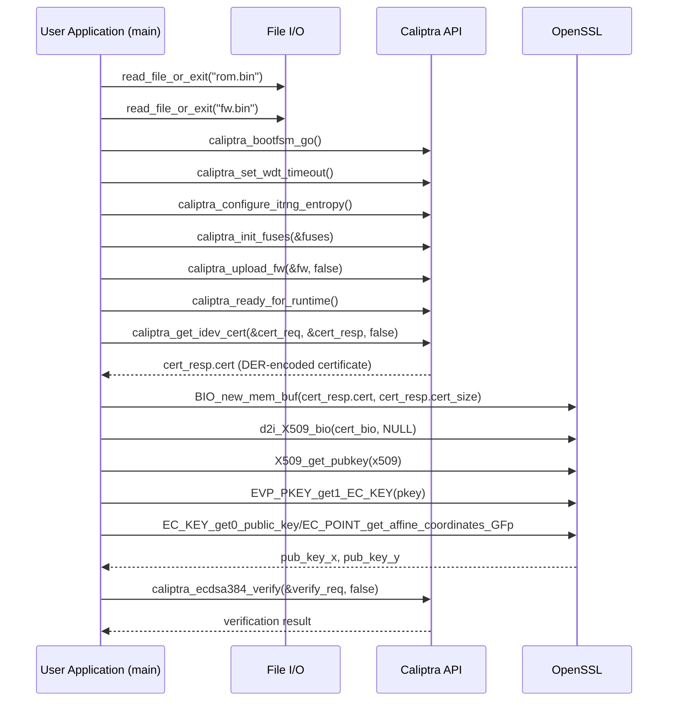

# certificate_and_signature_verification.c シーケンス図

```mermaid
sequenceDiagram
    participant App as User Application (main)
    participant FileIO as File I/O
    participant Caliptra as Caliptra API
    participant OpenSSL as OpenSSL

    App->>FileIO: read_file_or_exit("rom.bin")
    App->>FileIO: read_file_or_exit("fw.bin")
    App->>Caliptra: caliptra_bootfsm_go()
    App->>Caliptra: caliptra_set_wdt_timeout()
    App->>Caliptra: caliptra_configure_itrng_entropy()
    App->>Caliptra: caliptra_init_fuses(&fuses)
    App->>Caliptra: caliptra_upload_fw(&fw, false)
    App->>Caliptra: caliptra_ready_for_runtime()
    App->>Caliptra: caliptra_get_idev_cert(&cert_req, &cert_resp, false)
    Caliptra-->>App: cert_resp.cert (DER-encoded certificate)
    App->>OpenSSL: BIO_new_mem_buf(cert_resp.cert, cert_resp.cert_size)
    App->>OpenSSL: d2i_X509_bio(cert_bio, NULL)
    App->>OpenSSL: X509_get_pubkey(x509)
    App->>OpenSSL: EVP_PKEY_get1_EC_KEY(pkey)
    App->>OpenSSL: EC_KEY_get0_public_key/EC_POINT_get_affine_coordinates_GFp
    OpenSSL-->>App: pub_key_x, pub_key_y
    App->>Caliptra: caliptra_ecdsa384_verify(&verify_req, false)
    Caliptra-->>App: verification result
```

---

このシーケンス図は、
- ROM/FWイメージのロード
- Caliptraの初期化、FWのロード、ランタイム待機
- 証明書の取得
- OpenSSLを使用した公開鍵の抽出
- 署名検証リクエスト
という一連の流れを表しています。
